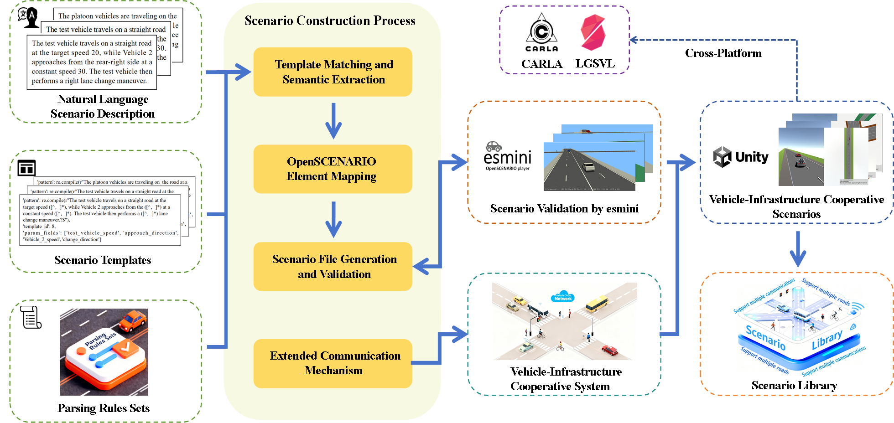

# Template Matching Based Automated Test Scenarios Construction for Vehicle-Infrastructure Cooperative System

This repository presents an automated method for constructing vehicle-infrastructure cooperative test scenarios. It transforms predefined natural language scenario descriptions into OpenSCENARIO-compliant files and supports V2X message interaction in a Unity3D-esmini co-simulation platform.


## Overview

Vehicle-infrastructure cooperative systems have significantly propelled the development of intelligent transportation and autonomous driving, increasing the demand for efficient and scalable testing scenario construction. However, constructing high-quality, systematic, and reusable vehicle-infrastructure cooperative testing scenarios remains challenging due to limited scalability, insufficient coverage, and low construction efficiency.

This project addresses these issues by using template matching and structured parsing to automatically generate standardized cooperative driving scenarios.

## Methodology

<p align="center">
  
</p>

The proposed framework consists of three main parts:

- Scenario template design based on the Human-Vehicle-Road-Environment framework
- Natural language parsing and OpenSCENARIO file generation
- V2X message management for RSU-OBU cooperative communication

The method supports the automatic transformation from predefined natural language descriptions to executable vehicle-infrastructure cooperative test scenarios.

## Scenario Library

A total of **1,044 vehicle-infrastructure cooperative test scenarios** were constructed.

The library provides broad coverage across scenario categories, road types, and V2X communication modes.

| Aspect | Coverage |
| :---: | :---: |
| Scenario Categories | 6 categories, including safety-related,  perception and recognition, efficiency-related, information service, formation vehicle, and operational vehicle scenarios |
| Road Types | 13 road types, covering straight roads, turning roads, continuous curves, uphill roads, and intersections |
| Communication Modes | V2I + V2N, V2V + V2N, V2P + V2N, and V2V + V2P + V2N |
| Scenario Scale | 1,044 standardized vehicle-infrastructure cooperative test scenarios |

## Demonstration

The generated scenarios were validated on a Unity3D-esmini co-simulation platform. Several representative generated scenarios are shown below as examples.


<table>
  <tr>
    <td align="center" width="50%">
      
      <p align="left">🟢 Tunnel Ahead</p>
    </td>
    <td align="center" width="50%">
      
      <p align="left">🔴 Modified Scenario (Collision)</p>
    </td>
  </tr>
</table>


## Key Features

- Automated scenario generation from natural language descriptions
- OpenSCENARIO-compliant file generation
- Template matching based construction process
- RSU-OBU V2X communication support
- Unity3D-esmini co-simulation validation
- Large-scale cooperative scenario library

## Repository Structure

```text
.
├── README.md
├── assets/
│   └── v2x-scenario-demo.png
├── templates/
├── parser/
├── generator/
├── communication/
└── scenarios/
```

## Status

The scenario construction framework and co-simulation validation have been completed. The scenario library contains more than 1,000 standardized cooperative driving test scenarios.


